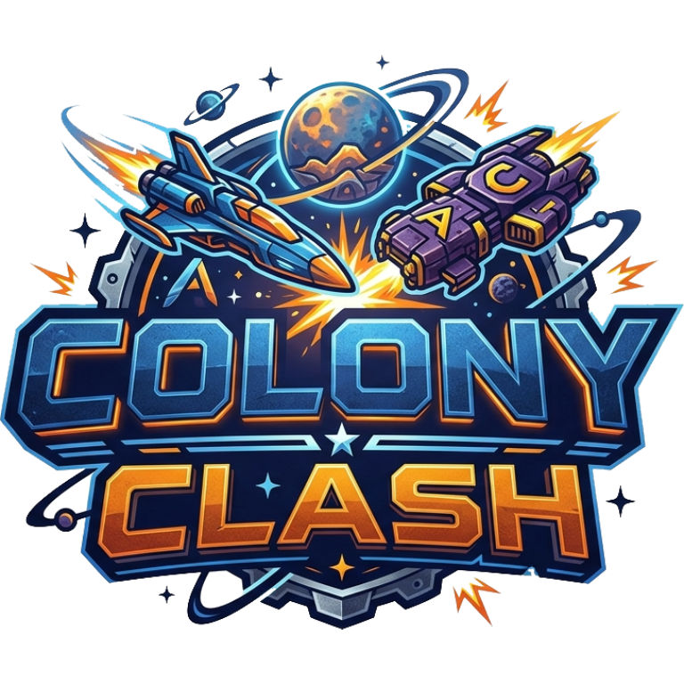

# 🌕 Colony Clash

> Construa sua base lunar, extraia recursos, treine tropas e domine a galáxia nesta batalha épica por supremacia espacial!



---

## 🎮 O Jogo

**Colony Clash** é um jogo de estratégia em tempo real para navegador, onde você assume o papel de um comandante de uma colônia lunar. Gerencie recursos escassos, expanda sua base com tecnologias avançadas e prepare seu exército para invadir colônias rivais.

### 💎 Destaques
- **Isometric Visuals**: Gráficos modernos com temática espacial.
- **Progressão Profunda**: 3 níveis de Centro de Comando com temas visuais (Ferro, Energia e Ouro).
- **Sistema de Ligas**: Suba no ranking e ganhe recompensas em gemas.
- **Pesquisa de Tropas**: Melhore os atributos de suas unidades no Laboratório.
- **Multiplayer Real**: Ataque outros jogadores e suba no ranking global (via Firebase).

---

## 🏗️ Construções e Recursos

### Recursos
| Recurso | Fonte | Uso Principal |
|---------|-------|---------------|
| ⛏️ **Minério** | Extrator de Minério | Construções e Melhorias |
| 💨 **Oxigênio** | Extrator de Oxigênio | Treinamento de Tropas e Construções |
| ⚡ **Energia** | Painel Solar | Pesquisa no Laboratório e Atividades da Base |
| 💎 **Gemas** | Ligas / Loja | Acelerar tempo e recursos |

### Tabela de Progressão do CC
| Nível | Tema | Principais Desbloqueios |
|-------|------|-------------------------|
| **CC 1** | ⚙️ Ferro | Extratores, Quartel N1, Acampamento, Torreta, Armazéns N1, **Drone** |
| **CC 2** | ⚡ Energia | +1 Acampamento, Quartel N2, Armazéns N2, **Robô** |
| **CC 3** | 🥇 Ouro | **Laboratório**, **Railgun**, Quartel N3, Armazéns N3, **Tanque** |

---

## 🪖 Unidades e Laboratório

As tropas podem ser melhoradas no **Laboratório** (disponível no CC 3) para aumentar sua Vida (HP), Dano ou Velocidade.

| Unidade | Espaço | HP Base | Dano Base | Prioridade |
|---------|--------|---------|-----------|------------|
| 🛸 **Drone** | 1 | 100 | 20 | Defesas |
| 🤖 **Robô** | 2 | 300 | 60 | Qualquer |
| 🚀 **Tanque** | 5 | 1000 | 200 | Recursos |

---

## 🏆 Sistema de Ligas

Ataque oponentes para ganhar troféus e subir de liga. Cada liga oferece bônus de gemas e tempo de escudo.

| Liga | Troféus | Recompensa 💎 | Escudo |
|------|---------|---------------|--------|
| ⚙️ **Ferro** | 0 - 399 | - | 8h |
| 🥉 **Bronze** | 400 - 799 | 20 | 10h |
| 🥈 **Prata** | 800 - 1299 | 50 | 10h |
| 🥇 **Ouro** | 1300 - 1999 | 100 | 12h |
| 💠 **Platina** | 2000 - 2999 | 200 | 12h |
| 💎 **Diamante** | 3000 - 4499 | 500 | 14h |
| 👑 **Lendário** | 4500+ | 1000 | 16h |

---

## 🚀 Como Deployar

### 1️⃣ Configurar Firebase (Obrigatório para Multiplayer)
1. Crie um projeto no [Firebase Console](https://console.firebase.google.com/).
2. Ative **Authentication** (Método Google e E-mail/Senha).
3. Ative **Firestore Database** em modo de produção.
4. Substitua as credenciais no arquivo `firebase-config.js`.
5. Configure as **Regras do Firestore**:
```javascript
rules_version = '2';
service cloud.firestore {
  match /databases/{database}/documents {
    match /colonies/{uid} {
      allow read:  if request.auth != null;
      allow write: if request.auth != null && request.auth.uid == uid;
    }
  }
}
```

### 2️⃣ Deploy no GitHub Pages
```bash
git init
git add .
git commit -m "🚀 Colony Clash: Lançamento Espacial"
git branch -M main
git remote add origin https://github.com/SEU_USUARIO/colony-clash.git
git push -u origin main
```
*Ative o GitHub Pages nas configurações do repositório (Settings -> Pages).*

---

## 📁 Estrutura do Projeto

```text
colony-clash/
├── index.html          # Interface principal e menus
├── style.css           # Estilização Neon Dark e Animações
├── game.js             # Motor do jogo (Lógica, Batalha, Firebase)
├── game-config.js      # Balanceamento, Custos e Traduções (i18n)
├── firebase-config.js  # ⚙️ CREDENCIAIS DO BANCO DE DADOS
├── server.ps1          # Script de servidor local (PowerShell)
└── assets/             # PNGs para todos os níveis de construções
    ├── cc_lvl1~3.png
    ├── barracks_lvl1~3.png
    ├── camp_lvl1~3.png
    ├── mineral_extractor_lvl1~3.png
    ├── solar_panel_lvl1~3.png
    ├── energy_storage_lvl1~3.png
    ├── laboratory_lvl1~3.png
    └── spritesheets/ (Tropas animadas)
```

---

## 🛡️ Painel Administrativo
Para desenvolvedores, ao logar com o e-mail `admin@colonyclash.com`, um painel especial é liberado no menu de configurações para testes de recursos, troféus e níveis de construção.

---

## 🧪 Desenvolvimento Local
Caso queira testar sem configurar o Firebase, o jogo entrará em **Modo Demo** automaticamente.
```powershell
./server.ps1
```
Ou use `npx serve .`

---

## 🗺️ Roadmap Futuro
- [x] Sistema de Ligas e Temporadas
- [x] Laboratório de Pesquisas
- [x] Assets de nível 2 e 3 para todas as construções
- [x] Sprites animados para tropas
- [ ] Chat Global e Sistema de Clãs
- [ ] Bosses de Eventos Globais

---

*Colony Clash — Conquiste a Lua!* 🌕⚔️
